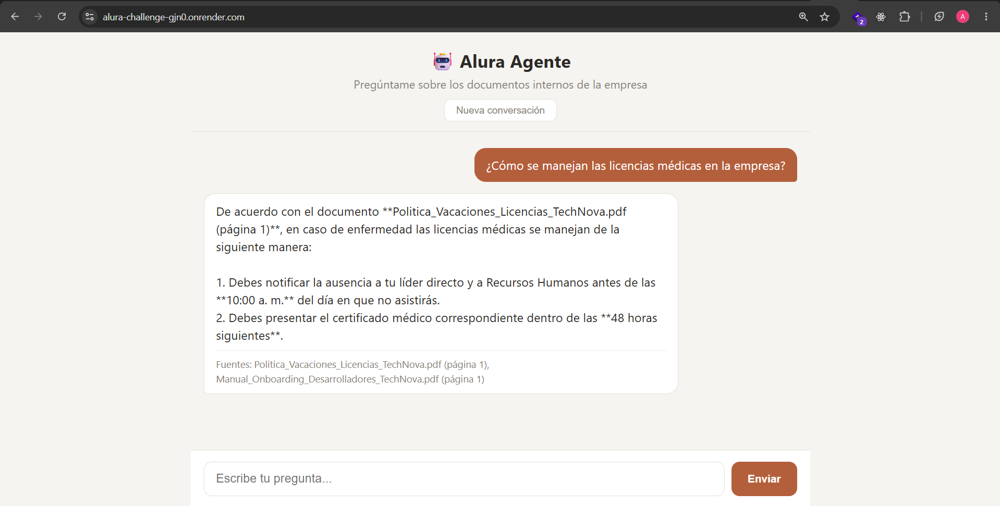

# Alura Agente - Agente de IA corporativo (RAG)

Este proyecto fue desarrollado para el Challenge Alura Agente del programa Oracle Next Education (ONE). La idea es simple: en vez de que las personas de una empresa tengan que abrir manuales, políticas o guías técnicas cada vez que tienen una duda, pueden simplemente preguntarle a un chat y recibir una respuesta directa, basada únicamente en los documentos internos reales de la empresa.

Para este desafío armé una empresa ficticia llamada **TechNova Solutions** y le creé tres documentos internos: una guía de arquitectura de back-end, un manual de onboarding para desarrolladores nuevos, y una política de vacaciones y licencias. El agente responde preguntas sobre estos tres documentos.

## Arquitectura

El proyecto es un monolito hecho con **FastAPI**: un solo servicio se encarga tanto de servir la interfaz del chat como de exponer la API que responde las preguntas. No usé microservicios ni nada separado porque para el alcance de este desafío no tenía sentido complicarlo.

Cuando el servidor arranca, lee todos los PDF que están dentro de la carpeta `documents/`, los divide en fragmentos más pequeños (chunks) usando LangChain, y genera un embedding de cada fragmento con la API de Gemini. Esos embeddings se guardan en una base de datos vectorial local con ChromaDB. Este proceso se repite cada vez que el servidor se reinicia, así que no hace falta correr ningún script aparte para "entrenar" nada.

Cuando alguien escribe una pregunta en el chat, pasa por varios pasos antes de llegar a una respuesta:

1. Si ya hay una conversación previa (el chat tiene memoria de los últimos mensajes), primero se reformula la pregunta para que tenga sentido por sí sola. Por ejemplo, si alguien pregunta "¿y las licencias de paternidad?" después de haber hablado de vacaciones, el sistema entiende que se refiere a la política de licencias.
2. Esa pregunta ya reformulada se convierte en un embedding y se compara contra los fragmentos guardados en ChromaDB, para encontrar los que más se relacionan semánticamente con lo que se preguntó.
3. Los fragmentos encontrados se le pasan a Gemini junto con la pregunta original, con instrucciones explícitas de responder solo con base en ese contexto y de avisar si la información no está disponible, en vez de inventar algo.
4. La respuesta se transmite hacia el navegador, junto con el nombre del documento del que salió la información.

El historial de la conversación se guarda únicamente en memoria del navegador (una variable de JavaScript), no en una base de datos ni en el servidor, así que se pierde si se recarga la página o si se presiona "Nueva conversación".

## Tecnologías utilizadas

- **Backend:** FastAPI (Python)
- **Frontend:** HTML + CSS + JavaScript vanilla, con Jinja2 para renderizar la plantilla
- **Framework de IA:** LangChain
- **LLM (generación de respuestas) y embeddings:** API de Gemini (Google AI Studio) — modelo de chat `gemini-3.5-flash` y modelo de embeddings `gemini-embedding-001`
- **Base de datos vectorial:** ChromaDB (se reconstruye en cada arranque del servidor, no persiste entre despliegues)
- **Lectura de PDF:** pypdf
- **Despliegue:** Render (plan gratuito)

## Cómo ejecutarlo localmente

1. Clonar el repositorio y entrar a la carpeta del proyecto.

2. Crear un entorno virtual e instalar las dependencias:
   ```
   python -m venv .venv
   .venv\Scripts\activate     # en Windows
   source .venv/bin/activate  # en Mac/Linux
   pip install -r requirements.txt
   ```

3. Obtener una API key gratuita de Gemini en [Google AI Studio](https://aistudio.google.com/api-keys).

4. Crear un archivo `.env` en la raíz del proyecto con la key:
   ```
   GEMINI_API_KEY=tu_api_key_aqui
   ```

5. Los tres PDF de ejemplo ya están dentro de `documents/`. Para probar con otros documentos, se pueden reemplazar ahí (por ahora solo se admite formato PDF).

6. Ejecutar el servidor:
   ```
   uvicorn app.main:app --reload
   ```

7. Abrir `http://localhost:8000` en el navegador.

## Estructura del proyecto

```
alura-agente/
├── app/
│   ├── main.py
│   ├── routes.py
│   ├── config.py
│   ├── services/
│   │   ├── gemini_service.py   → llamadas a Gemini (chat)
│   │   ├── pdf_service.py      → lectura y chunking de PDFs
│   │   └── rag_service.py      → embeddings, ChromaDB y recuperación
│   ├── templates/index.html
│   └── static/ (style.css, script.js)
├── documents/                   → los PDF que indexa el agente
├── requirements.txt
├── .env.example
├── .gitignore
└── README.md
```

## Ejemplos de preguntas y respuestas

Estas son ejemplos de cómo responde el agente con los documentos de TechNova Solutions que se incluyen en el repositorio:

**Pregunta:** ¿Qué lenguaje de programación se usa en el back-end?

**Respuesta del agente:** El lenguaje principal del back-end es Python, usando FastAPI para las APIs REST. El servicio de pagos es una excepción: está escrito en Go por temas de rendimiento. *(Fuente: Guia_Arquitectura_Backend_TechNova.pdf)*
<br>
<br>

**Pregunta:** ¿Cuántos días de vacaciones corresponden?

**Respuesta del agente:** Con contrato indefinido se tiene derecho a 15 días hábiles de vacaciones pagadas por año, una vez superado el período de prueba de 3 meses. A partir del tercer año en la empresa, el beneficio sube a 18 días hábiles. *(Fuente: Politica_Vacaciones_Licencias_TechNova.pdf)*
<br>
<br>

**Pregunta:** Si alguien se enferma, ¿qué debe hacer?

**Respuesta del agente:** Debe avisarle a su líder directo y a Recursos Humanos antes de las 10:00 a. m. del día de la ausencia, y presentar el certificado médico dentro de las 48 horas siguientes. *(Fuente: Politica_Vacaciones_Licencias_TechNova.pdf)*
<br>
<br>

**Pregunta:** ¿Qué pasa durante la primera semana en la empresa?

**Respuesta del agente:** El primer día hay una reunión de bienvenida con RH, se entrega el equipo y se crean las cuentas de Slack, GitHub y Jira. El segundo día se configura el entorno de desarrollo, y del tercer al quinto día hay sesiones de introducción con cada squad, además de que se asigna un buddy para el primer mes. *(Fuente: Manual_Onboarding_Desarrolladores_TechNova.pdf)*
<br>
<br>

**Pregunta:** ¿Cuál es la capital de Francia?

**Respuesta del agente:** No encontré esta información en los documentos disponibles. *(el agente reconoce que la pregunta está fuera del alcance de los documentos internos, en vez de inventar una respuesta)*
<br>
<br>

## Sobre el uso de planes gratuitos

Todo el proyecto corre sobre servicios 100% gratuitos: la API de Gemini (tanto para el chat como para los embeddings) y el plan free de Render para el hosting. Esto tiene algunas consecuencias que quiero dejar aclaradas:

- Como Render free "duerme" la aplicación después de un rato sin uso, la primera respuesta después de un tiempo de inactividad puede tardar bastante más de lo normal mientras el servidor vuelve a levantarse.
- La API gratuita de Gemini tiene un límite de solicitudes por minuto y por día. Si se supera, la API devuelve un error 429 (demasiadas solicitudes) y el agente no puede responder en ese momento. Si esto ocurre, conviene esperar y volver a intentarlo.

Ninguna de estas dos cosas es un error del proyecto en sí, son limitaciones esperables de usar únicamente herramientas gratuitas.

## Despliegue en producción

- **URL de la aplicación:** [https://alura-challenge-gjn0.onrender.com/](https://alura-challenge-gjn0.onrender.com/)
- **Captura de la aplicación funcionando:**

  
